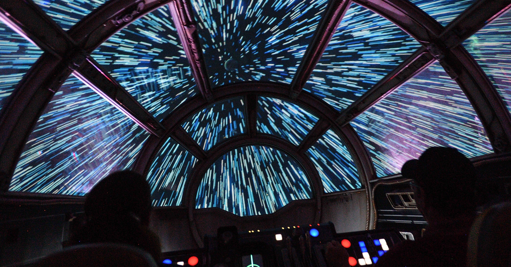

# Music Visualiser Project

Name: Diogo Cardoso Lessa Carmo Reis

Student Number: C19768619

# Description of the assignment

A starfield that moves according to the frequency of the song playing. It has 3 different "modes" the first one, which is the main one, a basic rainbow-colored field of stars that moves faster according to the song. The second one is a sort of hyperspace mode and the third and final one is a mix between the first one and a planetoid that has 3 different orbits of spheres around it, this planetoid grows bigger with the frequency of the song and the orbits increase their speed of rotation around the planetoid as well. All of these modes have an interactive perspective that the user can change based on the position of the mouse and the user can also choose from a selection of 4 songs chosen beforehand by me.

# Instructions

The user can switch between the different modes by pressing the following buttons:

- 0 = main mode (basic rainbow starfield)
- 1 = hyperspace
- 2 = planetoid
- q = Party like it's 1923 by Teminite
- w = After Dawn by Jaeger and Meric
- e = Waterfront by Detrace( which is by far my favorite)
- r = return to the first song (aka Inception by Teminite)
- space bar = pausing the song
- enter = restarting the song

As stated above moving the mouse will change the perspective of the user.

# How it works

Starfield.java is the class that runs everything in the background, it's responsible for the keyboard inputs
```    public void keyPressed()
    {
        if (keyCode >= '0' && keyCode <= '6') 
        {
            which = keyCode - '0';
        }
        if(key == ' ')
        {
            if (getAudioPlayer().isPlaying())
            {
                getAudioPlayer().pause();
            }
            else
            {
                getAudioPlayer().play();
            }
        }
        if(keyCode == ENTER)
        {
            getAudioPlayer().rewind();

            getAudioPlayer().play();
        }
        if(keyCode == 'Q')
        {
            getAudioPlayer().pause();
            setFrameSize(256);
            startMinim();
            loadAudio("1923.mp3");
            getAudioPlayer().play();
        }
        if(keyCode == 'W')
        {
            getAudioPlayer().pause();
            setFrameSize(256);
            startMinim();
            loadAudio("afterdawn.mp3");
            getAudioPlayer().play();
        }
        if(keyCode == 'E')
        {
            getAudioPlayer().pause();
            startMinim();
            loadAudio("waterfront.mp3");
            getAudioPlayer().play();
        }
        if(keyCode == 'R')
        {
            getAudioPlayer().pause();
            setFrameSize(256);
            startMinim();
            loadAudio("inception.mp3");
            getAudioPlayer().play();
        }
```
the settings
```    public void setup()
    {
        setFrameSize(256);
        startMinim();
        noCursor();
        loadAudio("inception.mp3");
        getAudioPlayer().play();
    }
```
Inside of starfield.java, star.java and planet.java are called in a switch case.
```switch(which)
        {
            case 0:
            {
                camera();
                translate(mouseX,mouseY);
                for(int i = 0; i < stars.length; i++)
                {
                    stars[i].update();
                    stars[i].show();
                }
                break;
                }
            case 1:
            {
                camera();
                translate(mouseX,mouseY);
                for(int i = 0; i < stars.length; i++)
                {
                    stars[i].update();
                    stars[i].show2();
                }
                break;
            }
            case 2:
            {
                translate(width/2 , height/2);
                for(int i = 0; i < stars.length; i++)
                {
                    stars[i].update();
                    stars[i].show();
                }
                pushMatrix();
                p.render();
                popMatrix();
                camera(width/2, height/2, 700, mouseX, mouseY, 0, 0, 1, 0);
                break;
            }   
        }
```
star[i].show is used to create the stars whilst star[i].update is used to update the position of the stars, so that the user has the feeling that the stars get bigger the closer they are to the user.
The planet class is used to create the planetoid and its different orbit of spheres. 
It is also in charge of their rotation.

Bellow will be images of the different modes of the program

- starfield


- hyperspace


- planetoid


# What I am most proud of in the assignment

The thing I'm most proud of is the hyperspace mode which i discovered by accident when I took pz = z out of the last for loop in star.java, which resets the position of pz to its original state. I decided to keep since it reminded me of how hyperspace used be displayed in "old movies"( for me at least, I remember specifically star wars ).



# Youtube video link

# References

https://www.youtube.com/watch?v=17WoOqgXsRM